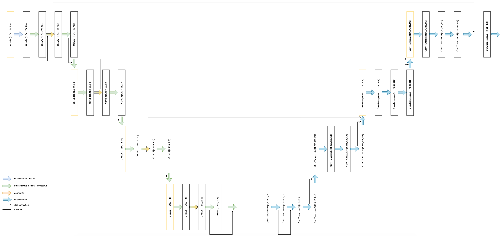
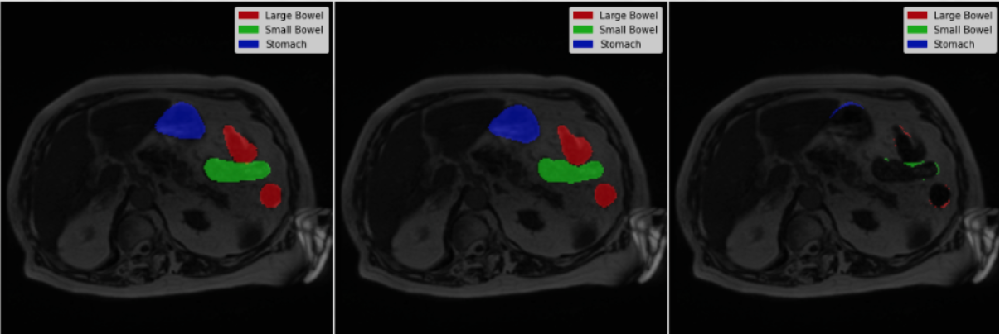

# GastrointestinalMRISegmentation
GastrointestinalMRISegmentation is a project where two neural networks are developed in order to perform Image Segmentation on MRI scans; in particular the task consists in segmenting, with a mask, the stomach, the large bowel and small bowel. 
The first neural network is developed and trained from scratch, while the second one is a pre-trained network (Unet++ architecture incorporating an EfficientNetB3 encoder pretrained on ImageNet) fine-tuned with the MRI scans dataset.

[Here1](requirements.pdf) there are the requirements of the project and [here2](documentation.pdf) is available the complete documentation 

(Repository for computational intelligence and deep learning's project)

## Main goals are:
- Data: preprocessing, augumentation and balancing
- Implement and train a neural network from scratch
- Develop a pre-trained neural network

   
   

